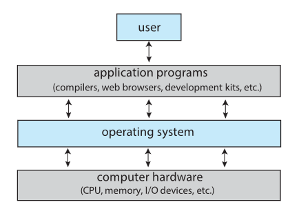

# What Operating Systems Do
> Chapter 1.1 (Silberschatz, Galvin & Gagne — *Operating System Concepts*)
> **Date:** 2026-07-13
> **Status:** 🔵 Done
> **Pages:** 28 - 31

---

## 1. Quick Summary (TL;DR)

## 2. Core Definitions
| Term | Definition |
|---|---|
|Hardware | The CPU, memory and IO devices that provide basic omputing resources|
|Application prgrams | Software like word, exel, and chrome that define how resources are used to solve computing problems.|
|kernel | The one program running at all times on the computer, THE COREOD THE OS. |
|Resource utilization| How different hardware and software resources are shared.|
|Control Program |manages the execution of user programs to prevent errors and improper use of the computer.|
|Resource Allocator | The role of the OS in managaing and deciding between conflicting requests for CPU time, memory and I/O devices to ensure efficiency and fairness/ |
|Control Program | The role of the OS in managing the execution of user programs o prevent errors and improper use of the system. |
|Middleware | Software frameworks, prominent in mobile environments like iOS and Android that provide additional services (databases, graphics) to developers.|
|Moore's Law| The number of transistors on an integrated circuit would double every 18 months. |

> The distinction between the "Kernel" and "System Programs" is a vital architectural boundary for the modern operating system. While the kernel represents the essential code path that remains active at all times—often operating in a protected mode to ensure system stability—system programs provide the management tools that, while associated with the operating system vendor, sit outside the core execution loop. This demarcation is critical for maintaining a robust hardware-software interface, as it ensures that only the most critical functions reside in the kernel, thereby limiting the surface area for system-wide failures.
While these definitions establish a technical baseline, the practical utility of an operating system is best observed through the lens of its functional components and their complex interactions.

## 3. Textbook Content

### 1.1 [What Operating Systems Do]

* Computer is divided into four(4) components
1. **Hardware**
 * Provides the basic computing resources for teh system
     * CPU
     * Memory (RAM and SSD/HDD)
     * Input/Output (I/O) devices (**Keyboard, Mouse, Monitor, Speakers, Mic, Camers, etc.**)

2. **Operating systems**
 * The OS controls the hardware and coordinates its use wih different apps for users
   * We can also view computer systems as hardware, software and data.
     * the OS gives us a proper way to use these resources.
   * OS has no useful function by itself, it just gives us an environment so other programs/components can do useful work

3. **The application program**
 * define ways in which resources are used to solve user computing problems
    * Word processors
    * Spreadsheet compilers
    * web browsers

4. **User**

### 1.1.1 [User View]

 * The user view is based on the interface being used (screen, voice etc.).
   * Most computer users use laptops or desktops which concists of these components
     * monitor, keyboard, mouse.
     * This system is designed for 1 user and focuses on maximising work that is being performed
     * The OS is designed for ease of use with some attention to performance, security and none of it is focused on resource utilisation
   * Many users use mobile devices like smartphones and tablets
     * Connect to networks via cellular or wireless tech.
     * UI features:
       * **touch screen** to interact with the system by pressing and swiping on it.
       * **Voice recognition** like Apple siri, google gemini, samsung bixby.
   * Some devices have little to no user view for example **embedded** computers/systems
     * could possible use keypads like wit home devices and automobiles
     * turn indicators use on off lights to show status
     * They and they OS are designed to run without UIs

### 1.1.2 [System View]

* From the computers POV the OS is involved with the hardware
  * In this context the OS is a resource allocator
* A computer has many resources needed to solve problems
  * CPU time
  * Memory space
  * storage space\I/O devices
  * etc.
* The OS manages these resources it decudes how to allocate the resources to a specific program and users so that it can operate the computer system efficiently and fairly.
* Another view of OS is the need to controll different I/O devices and user programs.
  * An OS is a control program.
  * And is especially concerned with the operation and control of I/O devices

### 1.1.3 [Defining Operating Systems]

* OS have many definitions based on roles and functions.
* Computers are  present in weird things like Toasters, cars, ships, etc.
* According to Moore's Lawthe number of transistors on integrated circuits woould double about every 18 months
  * This leads to smaller, faster, cheaper and more powerful computers.
  * Thus many different types of OS are developed

---

## 4. My Own Understanding

* OS is a broad thing which its definition will ultimately differ based on what it is being used for or on.
* OS in computers is usualy used to do certain tasks like managing resources, controlling I/O devices, and user programs.
* OS can be control programs
* The user view is how users interact with the OS sometims its on an interface, sometimes its a keyboard and sometimes its a switch like on a toaster or indicators.

---

## 6. Diagrams / Visuals

---

## 9. ⚠️ Common Misconceptions / Things That Tripped me Up

I use to think a OS was a piece of software that communicates with the hardware and nothing else like how we have windows, linux, macOS etc.

## 10. 🔑 Key Things to Remember

* **The Components of a computer system:** Hardware, OS, application and user.
* The OS is like a government it has no useful function by itself but provides an environment and controls the hardware so apps can do useful stuff
* **Two perspectives of the OS:**
  * User view;
    * The OS is tailored to the interface being used
  * System view:
    * Hardwares perspective, the OS does 2 tings
      * Resource allocation
        * CPU time, memory, storage and I/O device
      * Acts as a control program
        * manageing execution of programs

The OS has 3 core software distinctions:
1. **The kernel:** common technical definition of the OS is the kernel which is one program running at alll times on the computer
2. **Middleware:** additional services provided by the OS for developers like multimedia and database support.
3. **System Programs:** Programs that aid in managing teh system while it runs, but not stcrictly part of the core Kernel

---

## 11. ❓ Possible Exam / Test Questions

1. **Q:** What defines a single-processor system?
   **A:** A single-processor system is defined by having one general-purpose CPU with a single processing core. This system may include special-purpose processors for tasks like disk, keyboard, and graphics control, but only one general-purpose CPU executes processes.

2. 